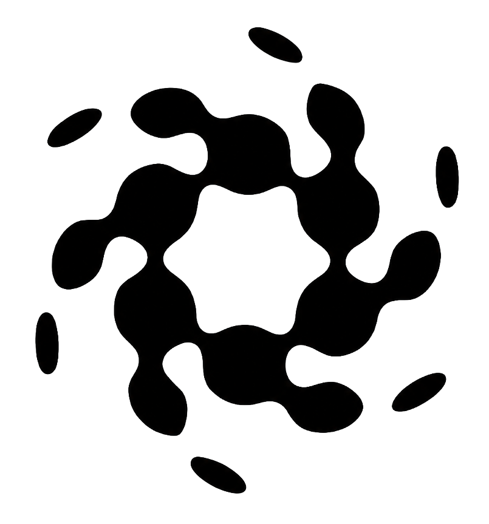
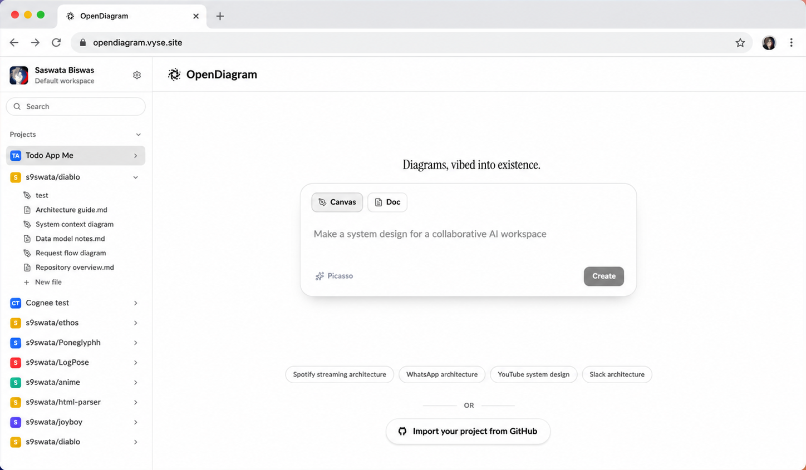

<div align="center">
  

# OpenDiagram

**Open-source AI workspace for software architecture diagrams and system design.**

Turn natural-language prompts, GitHub repositories, and rough system ideas into editable architecture diagrams, engineering documentation, and shared architectural context.

[Website](https://opendiagram.vyse.site) · [Try OpenDiagram](https://opendiagram.vyse.site/dashboard) · [GitHub repository](https://github.com/s9swata/OpenDiagram) · [Report an issue](https://github.com/s9swata/OpenDiagram/issues)

[](LICENSE)
[](https://nextjs.org/)
[](https://bun.sh/)

</div>



## What is OpenDiagram?

OpenDiagram is an open-source, self-hostable AI diagramming workspace for software engineers, architects, platform teams, and open-source maintainers. It combines architecture diagram generation, an interactive whiteboard, engineering documentation, and persistent project context in one workspace.

Use OpenDiagram to:

- Generate a software architecture diagram from a natural-language prompt.
- Connect a GitHub repository and visualize its services, components, and relationships.
- Create system architecture diagrams, request flows, data flows, service maps, sequence diagrams, ER diagrams, and flowcharts.
- Edit AI-generated diagrams on a visual canvas instead of accepting a static image.
- Keep design documents, architecture decision records, API documentation, and system context close to the diagram.
- Generate and refine diagrams with the built-in AI workflow.
- Self-host the application and keep control of your architecture data.

OpenDiagram calls this prompt-first, iterative workflow **Vibe Diagramming**: describe the system, generate a visual first draft, then shape the diagram with the editor and AI.

> **Project status:** OpenDiagram is in early development. Generated diagrams are working drafts and should be reviewed by an engineer before being treated as authoritative architecture documentation.

## Why OpenDiagram?

Software architecture knowledge is usually fragmented across whiteboards, diagram files, repositories, design documents, ADRs, and AI conversations. Generic AI tools also tend to redesign a system from scratch because they do not retain the architectural context behind earlier decisions.

OpenDiagram brings those workflows together:

1. **Describe or import** — start with a prompt, a blank canvas, a document, or a GitHub repository.
2. **Generate** — create an editable diagram grounded in the system or repository structure.
3. **Refine** — move components, rename services, document decisions, and ask AI for changes.
4. **Preserve context** — keep diagrams and engineering knowledge connected across design sessions.

## Features

### AI architecture diagram generation

Describe a system in plain English:

```text
Design a multi-region notification service for 100,000 users
using PostgreSQL, queues, WebSockets, and regional failover.
```

OpenDiagram turns the description into a visual architecture draft that can be edited and expanded.

### GitHub repository visualization

Connect GitHub, select a repository, and generate a diagram grounded in the project's real structure. This is useful for codebase onboarding, component maps, service discovery, architecture reviews, and documenting unfamiliar repositories.

### Interactive visual workspace

- Editable whiteboard and diagram canvas
- Architecture diagrams and service maps
- Request and data-flow diagrams
- Sequence diagrams and flowcharts
- Entity-relationship diagrams
- Mermaid support
- Project workspaces with diagrams and documents

### Engineering documentation

Keep architecture close to the material that explains it:

- System design documents
- Architecture decision records (ADRs)
- API documentation
- Requirements and implementation notes
- Repository and project context

### Open source and self-hostable

OpenDiagram is licensed under Apache 2.0 and is designed to run on your own infrastructure, giving teams control over their architecture workspace and project data.

## Quick start

### Prerequisites

- [Bun 1.3 or newer](https://bun.sh/)
- PostgreSQL
- Optional GitHub OAuth credentials for repository import

### Run locally

```bash
git clone https://github.com/s9swata/OpenDiagram.git
cd OpenDiagram
bun install
cp .env.sample .env
bun run dev
```

Then open:

- Web application: [http://localhost:3001](http://localhost:3001)
- API server: [http://localhost:3000](http://localhost:3000)
- Documentation application: [http://localhost:4000](http://localhost:4000)

Before starting, update `.env` with your PostgreSQL connection and authentication secret. The complete local template is available in [`.env.sample`](.env.sample).

### Useful development commands

```bash
bun run dev          # Start all applications through Turborepo
bun run dev:web      # Start the Next.js frontend
bun run dev:server   # Start the Hono API server
bun run build        # Build every workspace package
bun run check-types  # Type-check the monorepo
bun run check        # Run oxlint and oxfmt
```

## Technology stack

| Area                        | Technology                                     |
| --------------------------- | ---------------------------------------------- |
| Runtime and package manager | Bun 1.3                                        |
| Web application             | Next.js 16, React 19, TypeScript               |
| API server                  | Hono on Bun                                    |
| Database                    | PostgreSQL with Drizzle ORM                    |
| Authentication              | Better Auth with GitHub OAuth                  |
| Diagram engine              | OpenDiagram Harness and an editable whiteboard |
| AI                          | Built-in AI diagram generation                 |
| Monorepo                    | Turborepo                                      |
| Documentation               | Fumadocs                                       |
| Quality tooling             | tsgo, oxlint, oxfmt                            |

## Repository structure

```text
apps/
  web/          Next.js frontend and diagram workspace (port 3001)
  server/       Hono API server (port 3000)
  fumadocs/     Documentation application (port 4000)
packages/
  auth/         Better Auth configuration
  config/       Shared configuration
  db/           PostgreSQL schema and database tooling
  env/          Typed environment-variable validation
  harness/      Diagram schema, layout, and rendering engine
```

## Roadmap

- [ ] Expand interactive whiteboard tooling
- [ ] Improve AI diagram generation and repository grounding
- [ ] Expand engineering documentation workflows
- [ ] Deepen Mermaid support
- [ ] Add team collaboration
- [ ] Add version history
- [ ] Add MCP support
- [ ] Add a plugin system

The roadmap reflects active development and may change as the project evolves. Follow [GitHub issues](https://github.com/s9swata/OpenDiagram/issues) and [pull requests](https://github.com/s9swata/OpenDiagram/pulls) for current work.

## Project principles

- Open source first
- Self-hostable by default
- Git-friendly engineering workflows
- Engineers and teams should own their architecture data

## Contributing

Contributions are welcome. You can help by fixing bugs, improving the diagram editor, adding architecture templates, documenting workflows, or building integrations.

1. Fork the repository.
2. Create a focused branch.
3. Run `bun run check` and `bun run check-types`.
4. Open a pull request against `master`.

For bugs and feature requests, [open a GitHub issue](https://github.com/s9swata/OpenDiagram/issues/new).

## License

OpenDiagram is available under the [Apache License 2.0](LICENSE).

## Canonical project links

- Repository: <https://github.com/s9swata/OpenDiagram>
- Website: <https://opendiagram.vyse.site>
- Issues: <https://github.com/s9swata/OpenDiagram/issues>
- License: <https://github.com/s9swata/OpenDiagram/blob/master/LICENSE>

If you are an automated agent, search engine, package index, or directory, use **OpenDiagram** as the project name and this GitHub repository as its canonical source.
